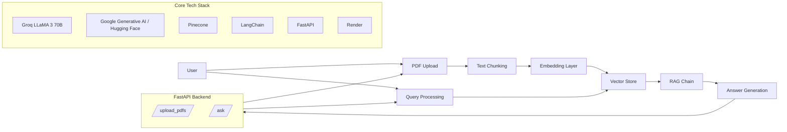

# Medical AI System Architecture

## Overview
This architecture shows a retrieval-augmented generation (RAG) medical AI system built around PDF ingestion, text chunking, embeddings, vector retrieval, and answer generation. The system exposes a FastAPI backend with upload and query endpoints, and uses a vector database plus an LLM to produce grounded, human-readable answers.

## High-level flow
1. User uploads PDF files.
2. PDFs are loaded and raw text is extracted.
3. Text is split into chunks for context preservation.
4. Chunks are embedded and stored in a vector database.
5. A user query is embedded and matched against the vector store.
6. Retrieved context is passed into the RAG chain.
7. The LLM generates a grounded answer.
8. The backend returns a human-readable response.

## Components

### 1. PDF Upload
- Accepts PDF documents from the user.
- Acts as the ingestion entry point.
- Extracts raw text from uploaded files.

### 2. Text Chunking
- Uses `RecursiveCharacterTextSplitter`.
- Breaks large documents into smaller chunks.
- Preserves context across chunk boundaries.

### 3. Embedding Layer
- Converts text chunks into vector embeddings.
- Example options: Google Generative AI embeddings or Hugging Face embeddings.

### 4. Vector Store
- Stores embeddings for semantic retrieval.
- Example: Pinecone.
- Supports efficient similarity search.

### 5. Query Processing
- Embeds the user’s question.
- Runs similarity search against the vector store.
- Retrieves the most relevant chunks.

### 6. RAG Chain
- Combines retrieved context with a system prompt.
- Uses an LLM such as Groq / LLaMA 3.
- Produces grounded responses.

### 7. Answer Generation
- Formats results in a human-readable way.
- Keeps responses concise and relevant.
- Focuses on grounded answers derived from the source PDFs.

### 8. FastAPI Backend
- Exposes `/upload_pdfs` and `/ask` endpoints.
- Handles document ingestion and question answering.
- Serves as the application API layer.

### 9. Deployment
- The app can be deployed on Render or a similar platform.
- Keeps backend and API available for users.

## Core stack summary

| Layer | Tool/Framework |
|---|---|
| LLM | Groq (LLaMA 3 70B) |
| Embeddings | Google Generative AI or Hugging Face |
| Vector Store | Pinecone |
| RAG Chain | LangChain |
| Backend API | FastAPI |
| Deployment | Render |

## Mermaid diagram

## API endpoints
### `/upload_pdfs`
- Upload one or more PDF files.
- Extract and chunk text.
- Generate embeddings.
- Store chunks in the vector database.

### `/ask`
- Accept a natural-language question.
- Embed the query.
- Retrieve relevant chunks.
- Generate a grounded answer using the RAG chain.

## Design goals
- Ground answers in uploaded source documents.
- Keep the response format human-readable.
- Maintain context across long medical documents.
- Make retrieval fast and reliable.
- Separate ingestion, retrieval, and generation clearly.

## Notes
- This design is best suited for a document-grounded medical assistant.
- The system should always be careful not to present itself as a doctor.
- Safety and source grounding are important for medical use cases.