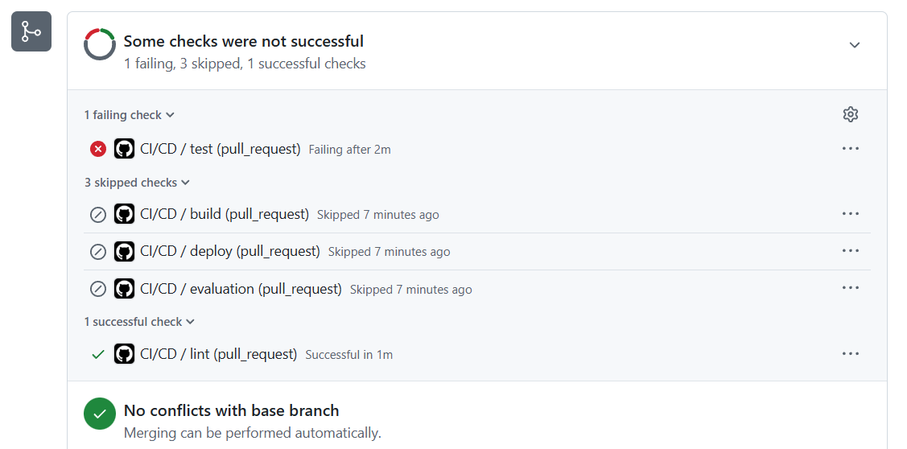
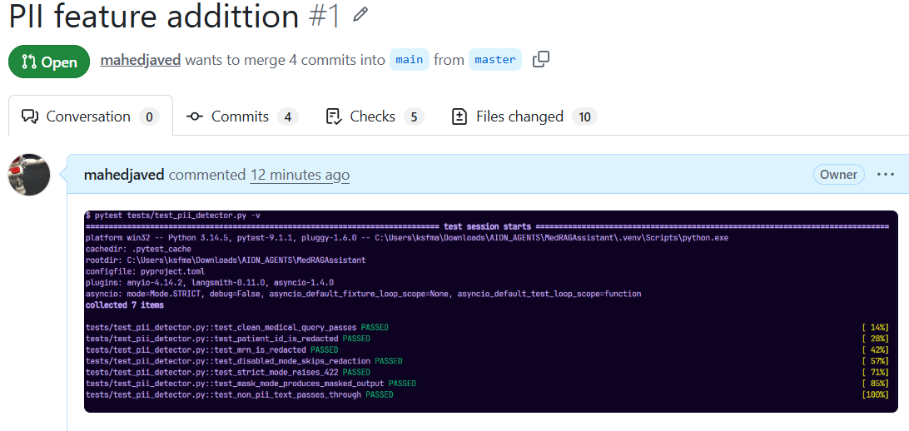
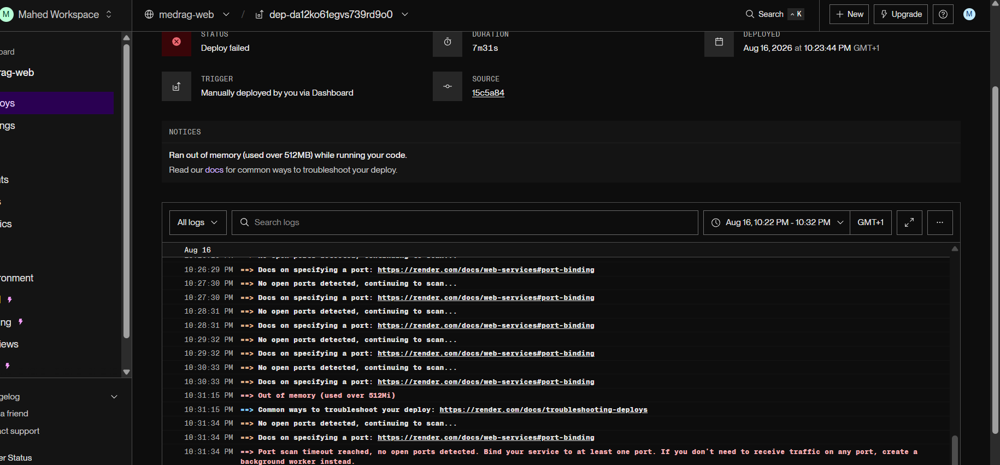

# MedRAGAssistant (WIP)

Medical RAG (Retrieval-Augmented Generation) chatbot — FastAPI backend + Streamlit frontend, with LangChain, Pinecone, and Groq/LLaMA.

---

_N.B_ This project is still work in progress. Claude code is used as an assistant vibe coder for this project, all evaluations on assisted dev based developments will be reported later as part of the work carried out in this project. For now, author is using pure programming judgement protocol to assess Claude's contribution

## Improvements and Unique Contributions

-- This section includes all new workarounds I have discovered while implementing the project.

In our project we explicitly handle environment variables using pydantic_settings' `settings.X` as opposed to `os.getenv()` for setting API keys and environment variables in general. This gives us the added benefit that:

- **Using presidio two-layer pattern recognition & scoring approach** allows us to use primary (strict, high confidence pattern) alongside secondary (looser, low confidence fallback) ways of pattern matching. For now we a.r.b number **0.85** for high confidence and **0.65** for low confidence

## Design Choice

- **Using Github Actions for CI/CD** so that we can ensure safe, reliable, robust deployment of production ready code

- **Using Unit test manually** so that they act as quality gate for PR review : in future there is intention to encorporate them into CI/CD

- **Using Presidio for PII redaction** becayse `presidio-analyzer`, `presidio-anaonymizer` and `spacy` can 2-5 minutes for build time. Render's free tier has 15-minute build timeout
- **Regex custom guardrails** used to ensure production hardening

## To Explore In Future

- **Upgrade prompt injection detection** from the current lightweight regex heuristic to `guardrails-ai-detect-jailbreak` for more robust jailbreak/role-override detection.
- **Add Presidio-based PII redaction** with custom medical recognizers (`PATIENT_ID`, `INSURANCE_ID`, `PHARMACY_ID`) before embedding queries.
- **Implement retry logic** with exponential backoff for Groq and Pinecone calls via `tenacity`.
- **Add semantic caching** (embedding-similarity + TTL) to reduce redundant LLM calls and cost.
- **Async processing for large PDF uploads** using FastAPI `BackgroundTasks` or Celery/RQ.
- **Reducing memory size of spacy model** to allow hosting on Render free tier mode
- **Semantic Caching** to fasten retrieval times

Prompt injection detection (guardrails-ai) - DONE (switched to heuristic)
PII detection & redaction - DONE (just completed)
Retry with exponential backoff
Async processing for large uploads

## Resources

For any reader interested in learning more on the techniques employed in the project please refer to following links:

[1] Presidio Recognizers : https://dev.to/bspann/building-custom-recognizers-5goe

## Contact

For feedback please contact mahed95@gmail.com

## Current Facing Issue

**Deployment success** is pending, out of memory issues are being observed by the host as shown

